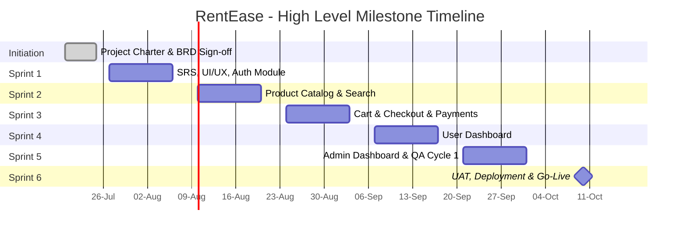

# PROJECT CHARTER

**Project Name:** RentEase – Furniture & Appliance Rental Platform
**Document Type:** Project Charter
**Document Version:** 1.0
**Date Prepared:** July 18, 2026
**Prepared By:** Kaushal Dwivedi, Project Manager
**Classification:** Internal – Project Governance Document

---

## Document Control

| Version | Date | Author | Description | Approved By |
|---------|------|--------|--------------|-------------|
| 0.1 | July 01, 2026 | Kaushal Dwivedi | Initial draft for internal review | — |
| 0.2 | July 08, 2026 | Kaushal Dwivedi | Incorporated stakeholder feedback | — |
| 1.0 | July 18, 2026 | Kaushal Dwivedi | Final version approved for execution | Steering Committee |

---

## 1. Executive Summary

RentEase is a full-stack online rental marketplace designed to allow end customers to browse, search, filter, and rent furniture and home appliances through a self-service digital platform, complete with integrated online payments, order tracking, and a dedicated administrative back office for inventory, order, user, and reporting management.

The project has been commissioned in response to a growing market opportunity in the furniture and appliance rental segment, driven by rising urban migration, short-term housing arrangements, and consumer preference for asset-light living. RentEase will be delivered using the Agile Scrum methodology over a **12-week timeline split across 6 sprints of 2 weeks each**, executed by a cross-functional team of **7 members**.

This charter formally authorizes the RentEase project, defines its scope, objectives, governance structure, and success criteria, and serves as the reference document against which all subsequent planning artifacts (BRD, SRS, Sprint Plans) will be aligned. Upon approval, the Project Manager is authorized to allocate organizational resources to project activities.

**Key Facts at a Glance**

| Attribute | Detail |
|---|---|
| Project Sponsor | VP of Digital Products |
| Project Manager | Kaushal Dwivedi |
| Methodology | Agile Scrum |
| Duration | 12 Weeks (6 Sprints × 2 Weeks) |
| Team Size | 7 Members |
| Estimated Budget | ₹42,80,000 (INR) |
| Target Go-Live | Week 12 (End of Sprint 6) |
| Primary Tech Stack | React.js, Node.js, Express.js, MongoDB, JWT, Tailwind CSS |
| Tools | Jira, GitHub, Slack, Confluence |

---

## 2. Business Case

### 2.1 Market Opportunity

The furniture and appliance rental industry has witnessed consistent double-digit growth, fueled by a rising population of students, young professionals, and short-term city relocators who prefer renting over purchasing due to cost, flexibility, and mobility considerations. Existing offline rental businesses are largely fragmented, offer limited product visibility, and lack digital payment and order-tracking convenience.

### 2.2 Problem Statement

The organization currently has no digital channel to capture this demand. Manual, phone-based rental inquiry processes result in:

- Long lead times between inquiry and order confirmation
- No real-time visibility into product availability
- High dependency on physical showroom visits
- Inefficient inventory reconciliation across warehouses
- Absence of a centralized customer or order database
- Limited scalability of the current operating model

### 2.3 Proposed Solution

RentEase will digitize the complete rental lifecycle — from product discovery to payment to fulfillment to return — through a responsive web application supported by a secure, scalable backend and a dedicated administrative dashboard for internal operations teams.

### 2.4 Expected Business Benefits

| Benefit Category | Description | Estimated Impact |
|---|---|---|
| Revenue Growth | New digital acquisition channel reducing dependency on walk-in customers | +25% new customer acquisition in 6 months post-launch |
| Operational Efficiency | Centralized inventory and order management reduces manual reconciliation | ~30% reduction in order-processing time |
| Customer Experience | Self-service browsing, filtering, and checkout | Higher NPS and reduced support ticket volume |
| Data-Driven Decisions | Centralized reporting for admin on inventory and sales trends | Improved demand forecasting accuracy |
| Cost Reduction | Reduced dependency on call-center based order booking | ~15% reduction in customer acquisition cost |

### 2.5 Return on Investment (Indicative)

| Metric | Year 1 Projection |
|---|---|
| Estimated Development Cost | ₹42,80,000 |
| Projected Incremental Revenue (Year 1) | ₹1,10,00,000 |
| Estimated Payback Period | 5–6 Months |
| Projected 3-Year ROI | ~220% |

---

## 3. Project Objectives

The RentEase project is defined by the following SMART objectives:

1. **Deliver a fully functional rental marketplace** covering authentication, catalog browsing, cart, checkout, payments, and user dashboards within 12 weeks.
2. **Deliver a secure and role-based Admin Dashboard** enabling inventory, order, user, and report management by Week 11.
3. **Achieve a system uptime of 99.5%** post-deployment through robust architecture and monitoring.
4. **Ensure secure transactions** by implementing JWT-based authentication and PCI-aware payment gateway integration.
5. **Complete User Acceptance Testing (UAT) with zero Sev-1/Sev-2 defects** prior to production go-live.
6. **Maintain sprint velocity consistency** across all 6 sprints with less than 10% scope variance per sprint.
7. **Deliver comprehensive documentation** (BRD, SRS, Test Plans, Deployment Guide) suitable for long-term maintainability.

---

## 4. Project Scope

### 4.1 In Scope

| # | Scope Item | Description |
|---|---|---|
| 1 | User Authentication | Registration, login, JWT-based session management, password reset |
| 2 | Home Page | Landing page with featured/trending rental products, banners, categories |
| 3 | Product Catalog | Listing of furniture and appliances with category-wise browsing |
| 4 | Search & Filters | Keyword search, category, price range, rental duration, availability filters |
| 5 | Shopping Cart | Add/remove/update items, rental duration selection, price calculation |
| 6 | Checkout & Payments | Address capture, payment gateway integration, order confirmation |
| 7 | User Dashboard | Order history, active rentals, rental extension/return requests, profile management |
| 8 | Admin Dashboard | Inventory CRUD, order management, user management, sales/inventory reports |
| 9 | Testing & Deployment | Unit, integration, and UAT testing; CI/CD-based deployment to staging & production |

### 4.2 Out of Scope

| # | Excluded Item | Rationale |
|---|---|---|
| 1 | Native Mobile Applications (iOS/Android) | Planned for Phase 2 post-MVP validation |
| 2 | Multi-language / Internationalization support | Not required for initial regional launch |
| 3 | AI-based product recommendation engine | Deferred to future enhancement roadmap |
| 4 | Logistics/delivery fleet management system | Handled by third-party logistics partner integration in later phase |
| 5 | Loyalty/rewards program | Out of scope for MVP; considered post-launch |
| 6 | Multi-currency support | Single-currency (INR) support only for MVP |
| 7 | Offline/POS integration for physical stores | Not part of current digital transformation phase |

---

## 5. Deliverables

| Deliverable | Description | Owner | Target Sprint |
|---|---|---|---|
| Project Charter | Formal project authorization document | Project Manager | Pre-Sprint 1 |
| Business Requirements Document (BRD) | Business needs, processes, and requirements | Product Owner / PM | Pre-Sprint 1 |
| Software Requirements Specification (SRS) | Technical and functional specification | PM / Dev Leads | Sprint 1 |
| UI/UX Wireframes & Design System | Tailwind CSS-based design components | Frontend Team | Sprint 1 |
| Authentication Module | Registration, login, JWT security | Backend Team | Sprint 1 |
| Product Catalog & Search Module | Product listing, filters, search | Full Stack Team | Sprint 2 |
| Cart & Checkout Module | Cart management, payment integration | Full Stack Team | Sprint 3 |
| User Dashboard | Rental history, order tracking | Frontend/Backend Team | Sprint 4 |
| Admin Dashboard | Inventory, order, user, and reporting management | Full Stack Team | Sprint 5 |
| Test Plan & QA Reports | Test cases, defect logs, UAT sign-off | QA Engineer | Sprint 5–6 |
| Deployment & Release Documentation | CI/CD pipeline, deployment runbook | Backend Team / PM | Sprint 6 |
| Production Go-Live | Fully deployed, monitored production system | Entire Team | Sprint 6 |

---

## 6. Assumptions

1. Business stakeholders will be available for sprint reviews and UAT sign-off within agreed SLAs.
2. Third-party payment gateway sandbox credentials will be provided by Week 3.
3. Product and inventory data (SKUs, categories, images) will be supplied by the business team by Sprint 2.
4. Team members are dedicated full-time to this project for the full 12-week duration.
5. Cloud infrastructure (hosting, domain, SSL) will be provisioned by the DevOps/Infra team by Week 1.
6. No major scope changes will be introduced after Sprint 3 without formal change control.
7. Existing organizational GitHub and Jira licenses will be used; no new procurement is required.

---

## 7. Constraints

| Constraint Type | Description |
|---|---|
| Time | Fixed 12-week delivery window with a hard go-live date |
| Budget | Fixed budget ceiling of ₹42,80,000; no contingency beyond 10% |
| Resources | Fixed team size of 7; no additional hiring planned during execution |
| Technology | Mandated tech stack (MERN + Tailwind CSS + JWT) per organizational standards |
| Compliance | Payment processing must align with PCI-DSS handling guidelines (via gateway provider) |
| Tooling | Jira and GitHub are the mandated tools for tracking and version control |

---

## 8. High-Level Milestones

| Milestone | Target Date | Exit Criteria |
|---|---|---|
| M1: Charter & BRD Approved | Week 0 | Sign-off from Sponsor & Product Owner |
| M2: SRS & Design System Finalized | End of Sprint 1 | Auth module deployed to staging |
| M3: Catalog & Search Live on Staging | End of Sprint 2 | Product browsing functional |
| M4: Payments Integrated | End of Sprint 3 | End-to-end checkout functional in staging |
| M5: User Dashboard Complete | End of Sprint 4 | Rental tracking functional |
| M6: Admin Dashboard Complete | End of Sprint 5 | Inventory/order/report management functional |
| M7: Production Go-Live | End of Sprint 6 | UAT signed off, zero Sev-1/Sev-2 defects |

---

## 9. Budget

### 9.1 Budget Summary

| Cost Category | Amount (INR) | % of Total |
|---|---|---|
| Team Salaries (12 weeks, 7 members) | ₹33,60,000 | 78.5% |
| Cloud Infrastructure & Hosting | ₹2,40,000 | 5.6% |
| Third-Party Tools & Licenses (Jira, GitHub, Payment Gateway fees) | ₹1,80,000 | 4.2% |
| Design & Asset Procurement | ₹80,000 | 1.9% |
| Contingency Reserve (10%) | ₹4,20,000 | 9.8% |
| **Total Estimated Budget** | **₹42,80,000** | **100%** |

### 9.2 Resource Cost Breakdown (Weekly, Illustrative)

| Role | Count | Weekly Rate (₹) | 12-Week Cost (₹) |
|---|---|---|---|
| Project Manager | 1 | 45,000 | 5,40,000 |
| Product Owner | 1 | 42,000 | 5,04,000 |
| Scrum Master | 1 | 38,000 | 4,56,000 |
| Frontend Developer | 2 | 35,000 each | 8,40,000 |
| Backend Developer | 2 | 36,000 each | 8,64,000 |
| QA Engineer | 1 | 30,000 | 3,60,000 |
| **Total** | **7** | — | **₹33,60,000** (rounded, includes buffer) |

---

## 10. Risk Register (Summary)

| Risk ID | Risk Description | Category | Likelihood | Impact | Mitigation Strategy | Owner |
|---|---|---|---|---|---|---|
| R1 | Delay in payment gateway sandbox access | Technical | Medium | High | Initiate vendor onboarding in Week 1; identify backup gateway | Backend Lead |
| R2 | Scope creep from stakeholders mid-sprint | Schedule | Medium | High | Enforce formal change control via Product Owner | Product Owner |
| R3 | Underestimation of QA effort for payment flows | Quality | Medium | Medium | Allocate dedicated QA sprint buffer in Sprint 5–6 | QA Engineer |
| R4 | Key resource unavailability (illness/attrition) | Resource | Low | High | Cross-training & documentation of critical modules | Scrum Master |
| R5 | Data migration/seeding delays for product catalog | Operational | Medium | Medium | Business team to supply data by Sprint 2 start | Product Owner |
| R6 | Security vulnerabilities in authentication/payment | Security | Low | High | Code reviews, JWT best practices, penetration testing pre-launch | Backend Lead |
| R7 | Third-party API rate limits/downtime | Technical | Low | Medium | Implement retry logic and fallback handling | Backend Lead |
| R8 | Browser/device compatibility issues | Technical | Medium | Low | Cross-browser testing in QA cycles | QA Engineer |

*A detailed Risk Management Plan is maintained separately in Jira under the "RentEase Risk Log" board.*

---

## 11. Stakeholders

| Stakeholder | Role | Interest / Influence | Engagement Approach |
|---|---|---|---|
| VP of Digital Products | Project Sponsor | High / High | Weekly steering updates, milestone sign-offs |
| Kaushal Dwivedi | Project Manager | High / High | Daily oversight, sprint governance |
| Product Owner | Business Representative | High / High | Backlog grooming, sprint reviews, UAT |
| Scrum Master | Process Facilitator | Medium / High | Daily stand-ups, impediment removal |
| Development Team (4) | Delivery Team | High / Medium | Sprint ceremonies, technical planning |
| QA Engineer | Quality Assurance | High / Medium | Test planning, defect triage |
| Operations/Warehouse Team | End Business User | Medium / Low | Requirements input, UAT participation |
| Customers (End Users) | Product Users | High / Low | Represented via Product Owner and UAT feedback |
| Finance Department | Budget Approver | Low / Medium | Budget approval, cost tracking reports |
| IT/DevOps Team | Infrastructure Support | Medium / Medium | Environment provisioning, deployment support |

---

## 12. Roles & Responsibilities (RACI Summary)

| Activity | PM | Product Owner | Scrum Master | Dev Team | QA Engineer |
|---|---|---|---|---|---|
| Project Charter Approval | A/R | C | I | I | I |
| Backlog Prioritization | C | A/R | C | I | I |
| Sprint Planning | A | R | R | C | C |
| Daily Stand-ups | I | I | R | R | R |
| Development | I | I | I | A/R | C |
| Testing & QA | I | C | I | C | A/R |
| Sprint Review/Demo | A | R | R | R | C |
| UAT Sign-off | A | R | I | I | C |
| Deployment | A | I | I | R | C |
| Risk & Issue Management | A/R | C | R | C | C |

*R = Responsible, A = Accountable, C = Consulted, I = Informed*

### 12.1 Detailed Role Descriptions

**Project Manager (Kaushal Dwivedi)** — Owns overall project delivery, budget, timeline, stakeholder communication, and risk management. Acts as the escalation point for cross-team dependencies.

**Product Owner** — Owns the product backlog, defines and prioritizes user stories, represents business/customer interests, and provides sprint-level acceptance of deliverables.

**Scrum Master** — Facilitates Scrum ceremonies, removes impediments, coaches the team on Agile practices, and shields the team from external disruptions.

**Frontend Developers (2)** — Responsible for building the React.js + Tailwind CSS user interface, including catalog, cart, checkout, and dashboard views.

**Backend Developers (2)** — Responsible for Node.js/Express.js APIs, MongoDB schema design, JWT authentication, and payment gateway integration.

**QA Engineer** — Responsible for test planning, functional/regression/UAT testing, defect logging in Jira, and sign-off prior to release.

---

## 13. Success Criteria

| Criteria | Target |
|---|---|
| On-time delivery | Go-live within 12-week window |
| Budget adherence | Within 10% of approved budget |
| Sprint velocity consistency | Variance < 10% across sprints |
| Defect leakage to production | Zero Sev-1/Sev-2 defects at go-live |
| UAT sign-off | 100% critical user stories accepted |
| System availability post-launch | ≥ 99.5% uptime in first 30 days |
| Stakeholder satisfaction | ≥ 4/5 average sponsor satisfaction score |

---

## 14. Approval Section

This Project Charter is formally reviewed and approved by the undersigned, authorizing the Project Manager to proceed with resource allocation and project execution as described herein.

| Name | Role | Signature | Date |
|---|---|---|---|
| _______________________ | Project Sponsor (VP, Digital Products) | _______________________ | ____ / ____ / 2026 |
| _______________________ | Product Owner | _______________________ | ____ / ____ / 2026 |
| Kaushal Dwivedi | Project Manager | _______________________ | ____ / ____ / 2026 |
| _______________________ | Finance Approver | _______________________ | ____ / ____ / 2026 |

---

*End of Project Charter — RentEase Furniture & Appliance Rental Platform*
