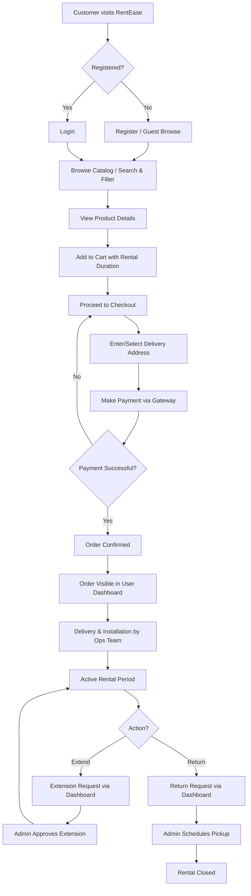
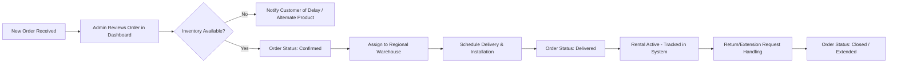

# BUSINESS REQUIREMENTS DOCUMENT (BRD)

**Project Name:** RentEase – Furniture & Appliance Rental Platform
**Document Version:** 1.0
**Date:** July 18, 2026
**Prepared By:** Kaushal Dwivedi, Project Manager (in collaboration with Product Owner)
**Status:** Approved for Development

---

## Document Control

| Version | Date | Author | Changes |
|---|---|---|---|
| 0.1 | July 03, 2026 | Product Owner | Initial draft |
| 0.2 | July 10, 2026 | Kaushal Dwivedi | Added process flows, use cases |
| 1.0 | July 18, 2026 | Kaushal Dwivedi | Finalized after stakeholder review |

---

## Table of Contents

1. Business Overview
2. Current Business Problems
3. Business Objectives
4. Stakeholders
5. Business Requirements
6. Functional Requirements
7. Non-Functional Requirements
8. User Roles
9. Business Process Flow
10. Use Cases
11. User Stories
12. Acceptance Criteria
13. Business Rules
14. Constraints
15. Assumptions
16. Success Metrics

---

## 1. Business Overview

RentEase is envisioned as a digital-first furniture and appliance rental business unit, extending the organization's existing rental operations into a self-service e-commerce model. The platform will allow individual and institutional customers (students, working professionals, relocating families) to rent home furniture (beds, sofas, tables, wardrobes) and appliances (refrigerators, washing machines, air conditioners, televisions) for flexible durations ranging from one month to twelve months, with options to extend, exchange, or terminate rentals.

The organization currently operates through a network of regional showrooms and a call-center-based order intake process. This BRD captures the business need to transition a significant portion of that demand to an online channel, supported by a robust backend for inventory, order, and customer management.

RentEase will operate on a **Business-to-Consumer (B2C)** model, with an internal **Admin Dashboard** enabling operations staff to manage catalog, inventory, orders, and customers centrally across regions.

### 1.1 Business Model Summary

| Aspect | Description |
|---|---|
| Revenue Model | Monthly/recurring rental fee per product, collected via upfront online payment for the selected rental term |
| Customer Segments | Urban renters, students, corporate relocations, short-term residents |
| Geographic Scope | Initial launch in Tier-1 and Tier-2 Indian cities where warehouse infrastructure exists |
| Fulfillment | Delivery and installation handled by existing regional logistics partners (integration out of scope for MVP; manual coordination via Admin Dashboard) |

---

## 2. Current Business Problems

| # | Problem Statement | Business Impact |
|---|---|---|
| BP-1 | No online catalog exists; customers must call or visit a showroom to know product availability | Loss of potential customers who prefer self-service digital research |
| BP-2 | Manual order booking via phone leads to human error in capturing product, duration, and address details | Increased order errors and customer dissatisfaction |
| BP-3 | No centralized system to track which products are rented, available, or under maintenance | Inventory mismatches across warehouses, leading to overbooking or missed rentals |
| BP-4 | Payment collection is largely cash-on-delivery or manual bank transfer | Delayed cash flow, reconciliation overhead, fraud risk |
| BP-5 | Customers have no self-service way to view rental status, due dates, or request extensions | High inbound call volume to customer support |
| BP-6 | No consolidated reporting for management on rental trends, revenue, or inventory utilization | Delayed and inaccurate business decision-making |
| BP-7 | No structured user account system; repeat customers must re-share information every time | Poor customer experience and lost personalization opportunities |

---

## 3. Business Objectives

1. Launch a self-service digital rental platform within 12 weeks that reduces dependency on manual/phone-based order booking by at least 60% within 6 months of launch.
2. Provide real-time visibility of product availability to reduce overbooking incidents to near zero.
3. Enable secure, cashless online payment collection to improve cash flow predictability.
4. Provide customers a self-service dashboard to manage active rentals, reducing support call volume by an estimated 30%.
5. Provide operations teams a centralized Admin Dashboard for inventory, order, and user management across all regions.
6. Establish a foundation of reporting and analytics to support data-driven inventory planning.
7. Build a scalable technical foundation (MERN stack) that supports future expansion into mobile apps and new product categories.

---

## 4. Stakeholders

| Stakeholder Group | Representative | Primary Interest |
|---|---|---|
| Executive Sponsor | VP, Digital Products | Business growth, ROI, brand digital presence |
| Product Owner | Business Product Lead | Feature prioritization, backlog ownership |
| Operations Team | Warehouse & Fulfillment Managers | Inventory accuracy, order fulfillment feasibility |
| Customer Support Team | Support Lead | Reduced ticket volume, self-service tooling |
| Finance Team | Finance Controller | Payment reconciliation, revenue reporting |
| IT/Security Team | IT Security Lead | Data protection, authentication security |
| End Customers | N/A (represented via Product Owner and UAT panel) | Ease of browsing, transparent pricing, reliable service |
| Development Team | Frontend/Backend Developers | Clear, testable requirements |
| QA Team | QA Engineer | Verifiable acceptance criteria |

---

## 5. Business Requirements

| BR ID | Business Requirement | Priority |
|---|---|---|
| BR-01 | The platform shall allow customers to create and manage a personal account | Must Have |
| BR-02 | The platform shall display a catalog of rentable furniture and appliances with images, descriptions, and pricing | Must Have |
| BR-03 | The platform shall allow customers to search and filter products by category, price, and availability | Must Have |
| BR-04 | The platform shall allow customers to add products to a cart and select rental duration | Must Have |
| BR-05 | The platform shall support secure online payment for rental orders | Must Have |
| BR-06 | The platform shall allow customers to view and manage their active and past rental orders | Must Have |
| BR-07 | The platform shall provide administrators a dashboard to manage inventory, orders, users, and reports | Must Have |
| BR-08 | The platform shall maintain audit logs of key transactions for compliance and troubleshooting | Should Have |
| BR-09 | The platform shall notify customers of rental due dates and renewal options via email/in-app | Should Have |
| BR-10 | The platform shall support role-based access for administrators vs. regular customers | Must Have |
| BR-11 | The platform shall be responsive across desktop, tablet, and mobile browsers | Must Have |
| BR-12 | The platform shall generate operational reports (sales, inventory utilization) for management | Should Have |

---

## 6. Functional Requirements

### 6.1 User Authentication

| FR ID | Requirement |
|---|---|
| FR-1.1 | Users shall be able to register using name, email, phone number, and password |
| FR-1.2 | Passwords shall be stored using industry-standard hashing (bcrypt) |
| FR-1.3 | Users shall be able to log in using registered email and password |
| FR-1.4 | The system shall issue a JWT access token upon successful login |
| FR-1.5 | Users shall be able to reset a forgotten password via email verification |
| FR-1.6 | The system shall auto-expire sessions after a configurable token expiry period |

### 6.2 Home Page

| FR ID | Requirement |
|---|---|
| FR-2.1 | The home page shall display featured and trending rental products |
| FR-2.2 | The home page shall display product categories (Furniture, Appliances) with navigation links |
| FR-2.3 | The home page shall display promotional banners configurable by Admin |

### 6.3 Product Catalog

| FR ID | Requirement |
|---|---|
| FR-3.1 | The system shall display all active products with image, name, category, and rental price |
| FR-3.2 | Each product detail page shall show specifications, rental plans, and availability status |
| FR-3.3 | The system shall display related/similar products on the product detail page |

### 6.4 Search & Filters

| FR ID | Requirement |
|---|---|
| FR-4.1 | Users shall be able to search products by keyword |
| FR-4.2 | Users shall be able to filter products by category, price range, and rental duration |
| FR-4.3 | Users shall be able to sort results by price (low-high, high-low) and popularity |

### 6.5 Shopping Cart

| FR ID | Requirement |
|---|---|
| FR-5.1 | Users shall be able to add/remove products to/from the cart |
| FR-5.2 | Users shall be able to select rental duration per product in the cart |
| FR-5.3 | The system shall dynamically calculate total rental cost including applicable taxes |

### 6.6 Checkout & Payments

| FR ID | Requirement |
|---|---|
| FR-6.1 | Users shall provide/select a delivery address during checkout |
| FR-6.2 | The system shall integrate with a payment gateway for online payment (cards, UPI, net banking) |
| FR-6.3 | The system shall generate an order confirmation upon successful payment |
| FR-6.4 | The system shall send an order confirmation email/notification |

### 6.7 User Dashboard

| FR ID | Requirement |
|---|---|
| FR-7.1 | Users shall view a list of active and past rental orders |
| FR-7.2 | Users shall be able to request rental extension or return |
| FR-7.3 | Users shall be able to update profile information and delivery addresses |

### 6.8 Admin Dashboard

| FR ID | Requirement |
|---|---|
| FR-8.1 | Admin shall be able to add, update, deactivate, and delete products/inventory |
| FR-8.2 | Admin shall be able to view and update order statuses (Placed, Confirmed, Delivered, Returned) |
| FR-8.3 | Admin shall be able to view and manage registered users |
| FR-8.4 | Admin shall be able to generate sales and inventory reports with date filters |

### 6.9 Testing & Deployment

| FR ID | Requirement |
|---|---|
| FR-9.1 | All modules shall undergo unit and integration testing prior to sprint sign-off |
| FR-9.2 | The system shall be deployed via a CI/CD pipeline to staging and production environments |

---

## 7. Non-Functional Requirements

| NFR ID | Category | Requirement |
|---|---|---|
| NFR-1 | Performance | Page load time shall not exceed 3 seconds under normal load (up to 500 concurrent users) |
| NFR-2 | Security | All data in transit shall be encrypted using HTTPS/TLS 1.2+ |
| NFR-3 | Security | Passwords shall never be stored in plaintext; JWT tokens shall have expiry and refresh mechanisms |
| NFR-4 | Availability | The system shall maintain 99.5% uptime post-launch |
| NFR-5 | Scalability | The system architecture shall support horizontal scaling of backend services |
| NFR-6 | Usability | The UI shall be responsive and accessible across screen sizes (mobile, tablet, desktop) |
| NFR-7 | Maintainability | Codebase shall follow modular architecture with documented REST APIs |
| NFR-8 | Compliance | Payment handling shall comply with PCI-DSS guidelines via certified gateway providers |
| NFR-9 | Auditability | All critical actions (order status changes, inventory edits) shall be logged with timestamp and user ID |
| NFR-10 | Backup | Database backups shall be taken daily with a minimum 7-day retention |

---

## 8. User Roles

| Role | Description | Key Permissions |
|---|---|---|
| Guest User | Unauthenticated visitor | Browse catalog, search/filter products, view product details |
| Registered Customer | Authenticated end user | All guest permissions + cart, checkout, dashboard, order management |
| Administrator | Internal operations staff | Manage inventory, orders, users, reports; full system configuration |
| Super Admin (future) | Reserved for multi-region scaling | Manage admin accounts and regional configurations (Phase 2) |

---

## 9. Business Process Flow

### 9.1 Customer Rental Journey

### 9.2 Admin Order Fulfillment Flow

---

## 10. Use Cases

### UC-01: Customer Registration

| Field | Detail |
|---|---|
| Use Case ID | UC-01 |
| Actor | Guest User |
| Description | A guest user creates a new account to access personalized features |
| Preconditions | User has a valid email address and phone number |
| Main Flow | 1. User navigates to Register page. 2. User enters name, email, phone, password. 3. System validates input. 4. System creates account and sends confirmation. 5. User is redirected to login. |
| Alternate Flow | Email already registered → system displays error and prompts login |
| Postcondition | New user account created in the system |

### UC-02: Search and Filter Products

| Field | Detail |
|---|---|
| Use Case ID | UC-02 |
| Actor | Guest User / Registered Customer |
| Description | User searches for products and narrows results using filters |
| Preconditions | Product catalog is populated |
| Main Flow | 1. User enters keyword or selects category. 2. User applies price/duration filters. 3. System returns matching products. |
| Alternate Flow | No products match filters → system displays "No results found" with suggestion to reset filters |
| Postcondition | Filtered product list displayed |

### UC-03: Add to Cart and Checkout

| Field | Detail |
|---|---|
| Use Case ID | UC-03 |
| Actor | Registered Customer |
| Description | Customer adds a product to the cart, selects rental duration, and completes payment |
| Preconditions | Customer is logged in; product is available |
| Main Flow | 1. Customer adds product to cart. 2. Customer selects rental duration. 3. Customer proceeds to checkout. 4. Customer enters/selects address. 5. Customer completes payment via gateway. 6. System confirms order. |
| Alternate Flow | Payment fails → system retains cart and displays retry option |
| Postcondition | Order created and visible in user dashboard |

### UC-04: Manage Rental Order

| Field | Detail |
|---|---|
| Use Case ID | UC-04 |
| Actor | Registered Customer |
| Description | Customer requests extension or return of an active rental |
| Preconditions | Customer has at least one active rental order |
| Main Flow | 1. Customer opens dashboard. 2. Customer selects active rental. 3. Customer requests Extend or Return. 4. Request routed to Admin for approval. |
| Postcondition | Request logged and pending admin action |

### UC-05: Admin Inventory Management

| Field | Detail |
|---|---|
| Use Case ID | UC-05 |
| Actor | Administrator |
| Description | Admin adds or updates product listings and inventory counts |
| Preconditions | Admin is authenticated with valid role |
| Main Flow | 1. Admin logs into Admin Dashboard. 2. Admin navigates to Inventory module. 3. Admin adds/edits product details and stock count. 4. System saves and reflects changes on customer-facing catalog. |
| Postcondition | Product catalog updated in real time |

### UC-06: Admin Order Management

| Field | Detail |
|---|---|
| Use Case ID | UC-06 |
| Actor | Administrator |
| Description | Admin reviews and updates the status of customer orders |
| Preconditions | Orders exist in the system |
| Main Flow | 1. Admin views order list. 2. Admin filters by status. 3. Admin updates order status (Confirmed/Delivered/Returned). |
| Postcondition | Order status updated and visible to customer |

### UC-07: Generate Reports

| Field | Detail |
|---|---|
| Use Case ID | UC-07 |
| Actor | Administrator |
| Description | Admin generates sales and inventory reports for a selected date range |
| Preconditions | Historical order/inventory data exists |
| Main Flow | 1. Admin navigates to Reports module. 2. Admin selects date range and report type. 3. System generates report/downloadable export. |
| Postcondition | Report available for review/download |

---

## 11. User Stories

| Story ID | As a... | I want to... | So that... | Priority |
|---|---|---|---|---|
| US-01 | Guest User | Register an account | I can access personalized rental features | Must Have |
| US-02 | Registered Customer | Log in securely | I can access my dashboard and order history | Must Have |
| US-03 | Registered Customer | Browse products by category | I can find furniture/appliances relevant to my needs | Must Have |
| US-04 | Registered Customer | Search and filter products | I can quickly find items within my budget | Must Have |
| US-05 | Registered Customer | Add products to a cart with a chosen rental duration | I can plan my monthly rental cost before checkout | Must Have |
| US-06 | Registered Customer | Pay securely online | I can complete my rental order without visiting a store | Must Have |
| US-07 | Registered Customer | View my active and past rentals | I can track what I've rented and when it's due | Must Have |
| US-08 | Registered Customer | Request a rental extension | I can continue using the product beyond the original term | Should Have |
| US-09 | Registered Customer | Request a product return/pickup | I can end my rental when I no longer need the product | Must Have |
| US-10 | Administrator | Add and manage product inventory | The catalog reflects accurate, up-to-date stock | Must Have |
| US-11 | Administrator | Update order statuses | Customers have visibility into their delivery/return progress | Must Have |
| US-12 | Administrator | View and manage registered users | I can support customers and resolve account issues | Should Have |
| US-13 | Administrator | Generate sales and inventory reports | I can make informed restocking and pricing decisions | Should Have |

---

## 12. Acceptance Criteria

| Story ID | Acceptance Criteria |
|---|---|
| US-01 | Given valid registration details, when the user submits the form, then an account is created and a confirmation is shown; duplicate emails are rejected with a clear error message |
| US-02 | Given valid credentials, when the user logs in, then a JWT token is issued and the user is redirected to the dashboard; invalid credentials show an error without revealing which field was incorrect |
| US-04 | Given a set of filters (category, price, duration), when applied, then only matching products are displayed within 2 seconds |
| US-05 | Given a product and selected duration, when added to cart, then the cart reflects the correct calculated rental price |
| US-06 | Given a valid payment method, when payment is submitted, then the order is confirmed and an order ID is generated; failed payments do not create a confirmed order |
| US-08 | Given an active rental, when a customer requests an extension, then the request appears in the Admin queue with status "Pending Approval" |
| US-10 | Given valid product data, when an admin submits a new product, then it appears in the customer-facing catalog within the same session |
| US-13 | Given a selected date range, when a report is generated, then totals reconcile with the underlying order/inventory records |

---

## 13. Business Rules

| BR-Rule ID | Rule |
|---|---|
| RULE-1 | A customer must be registered and logged in to complete checkout; guest checkout is not permitted in MVP |
| RULE-2 | Rental duration must be selected in whole-month increments (minimum 1 month) |
| RULE-3 | An order cannot be confirmed unless payment is successfully processed |
| RULE-4 | A product marked "Out of Stock" cannot be added to the cart |
| RULE-5 | Only users with the Administrator role can access the Admin Dashboard |
| RULE-6 | Rental extension requests require Admin approval before the due date is updated |
| RULE-7 | Order status transitions must follow the sequence: Placed → Confirmed → Delivered → Active → Returned/Closed |
| RULE-8 | All monetary calculations shall be rounded to two decimal places in INR |

---

## 14. Constraints

- Fixed 12-week delivery timeline with no scope extension beyond agreed sprint backlog.
- Mandated technology stack: React.js, Node.js, Express.js, MongoDB, JWT, Tailwind CSS.
- Payment gateway integration limited to providers supporting sandbox testing within Sprint 3.
- Single currency (INR) and single-region deployment for MVP.
- Team availability limited to 7 dedicated resources for the full engagement.

---

## 15. Assumptions

- Product and pricing data will be provided by the business/operations team in a structured format (spreadsheet/CSV) by Sprint 2.
- Payment gateway sandbox and production credentials will be available without procurement delays.
- Existing organizational infrastructure (cloud hosting account, domain, SSL certificates) will be available for deployment.
- Stakeholders will participate in sprint reviews and provide timely feedback within 2 business days.
- No major regulatory/compliance changes will occur during the project timeline that affect scope.

---

## 16. Success Metrics

| Metric | Target | Measurement Method |
|---|---|---|
| Platform adoption | 1,000+ registered users within 60 days of launch | Analytics/user database count |
| Order conversion rate | ≥ 3% of catalog visitors complete a rental order | Web analytics funnel tracking |
| Reduction in manual order calls | ≥ 60% reduction within 6 months | Call center volume comparison |
| Payment success rate | ≥ 95% of initiated payments completed successfully | Payment gateway logs |
| Customer support ticket volume | ≥ 30% reduction related to order status inquiries | Support ticketing system |
| System uptime | ≥ 99.5% in first 90 days | Infrastructure monitoring tools |
| UAT defect closure | 100% of Sev-1/Sev-2 defects closed before go-live | QA defect tracker (Jira) |

---

*End of Business Requirements Document — RentEase Furniture & Appliance Rental Platform*
