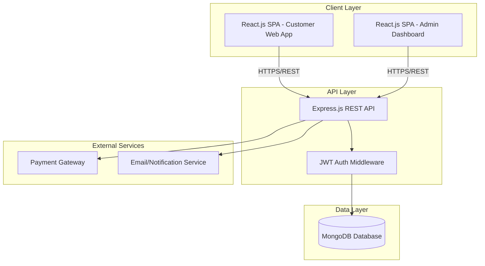
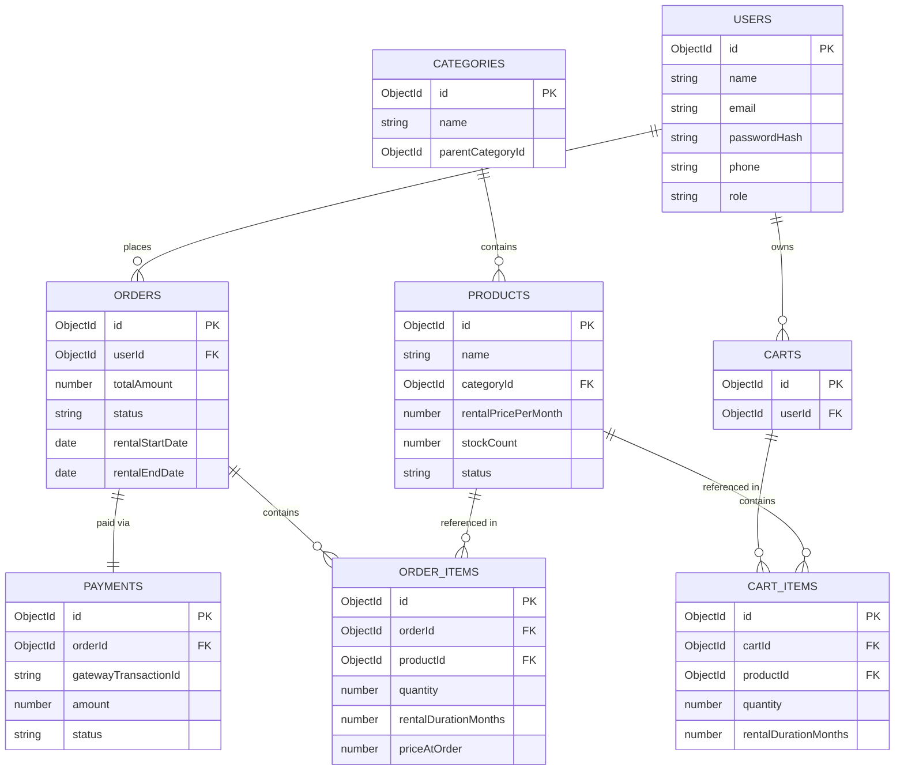
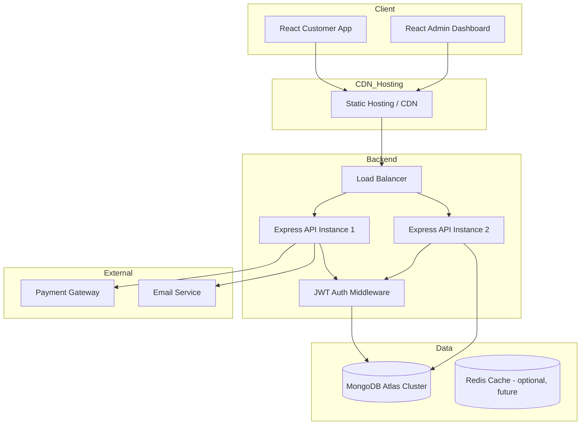
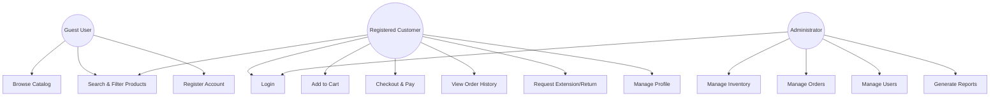
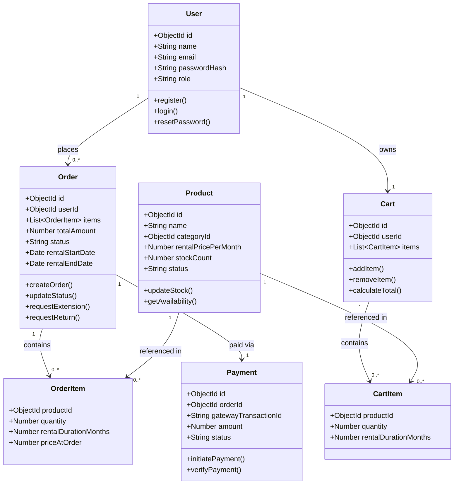
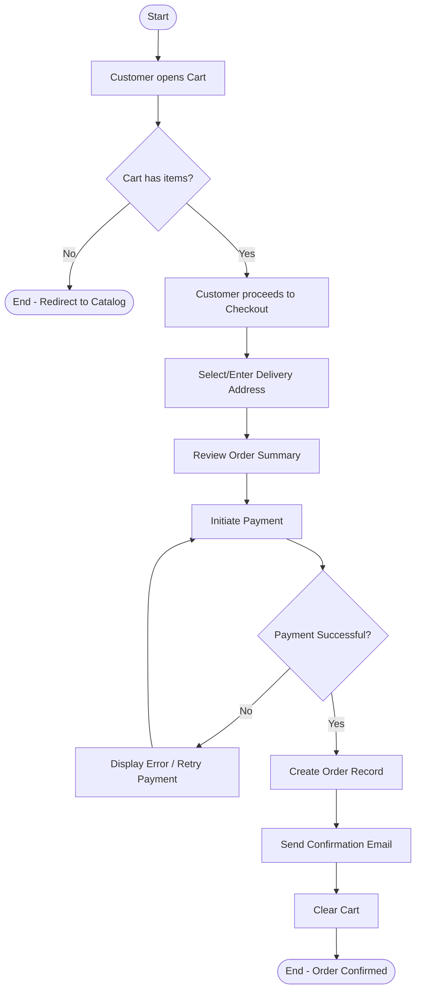
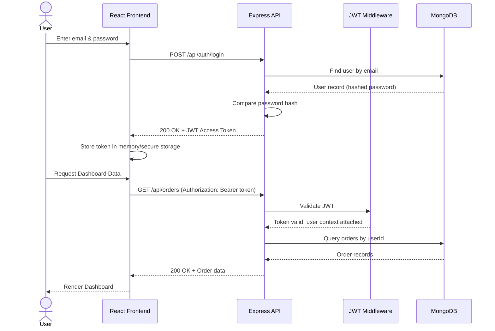
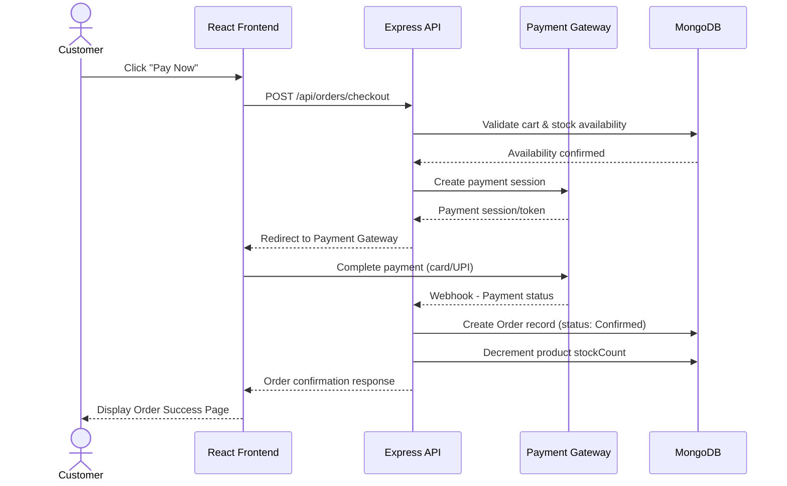

# SOFTWARE REQUIREMENTS SPECIFICATION (SRS)
### RentEase – Furniture & Appliance Rental Platform

**Document Version:** 1.0
**Date:** July 18, 2026
**Prepared By:** Kaushal Dwivedi, Project Manager
**Standard Followed:** IEEE 830 / IEEE 29148 SRS Format
**Status:** Approved Baseline for Development

---

## Document Control

| Version | Date | Author | Description |
|---|---|---|---|
| 0.1 | July 12, 2026 | Backend & Frontend Leads | Initial technical draft |
| 0.2 | July 15, 2026 | Kaushal Dwivedi | Added diagrams, API specs, security requirements |
| 1.0 | July 18, 2026 | Kaushal Dwivedi | Approved baseline |

---

## Table of Contents

1. Introduction
2. Overall Description
3. Functional Requirements
4. Non-Functional Requirements
5. External Interface Requirements
6. Database Design
7. System Architecture
8. REST API Specification
9. Security Requirements
10. Performance Requirements
11. Scalability
12. Backup & Recovery
13. Logging
14. Error Handling
15. Testing Requirements
16. Future Enhancements

---

# 1. Introduction

## 1.1 Purpose

This Software Requirements Specification (SRS) defines the complete functional, technical, and non-functional requirements for the RentEase Furniture & Appliance Rental Platform. It is intended to serve as the authoritative technical reference for the development, QA, and DevOps teams throughout the 12-week Agile Scrum delivery, and as a baseline artifact for future maintenance and enhancement phases.

This document is written to be understood by technical stakeholders (developers, architects, QA engineers) as well as project management and business stakeholders who require insight into system behavior and constraints.

## 1.2 Scope

RentEase is a MERN-stack (MongoDB, Express.js, React.js, Node.js) web application enabling customers to browse, search, rent, and pay for furniture and appliances online, while providing administrators a centralized dashboard for inventory, order, user, and reporting management.

The system scope includes:
- Customer-facing web application (React.js + Tailwind CSS)
- RESTful backend API (Node.js + Express.js)
- MongoDB-based persistent data store
- JWT-based authentication and authorization
- Payment gateway integration
- Administrative back-office dashboard
- CI/CD-based deployment pipeline via GitHub

The system explicitly excludes native mobile applications, multi-language support, AI-based recommendations, and third-party logistics fleet integration, as defined in the Project Charter.

## 1.3 Definitions, Acronyms, and Abbreviations

| Term | Definition |
|---|---|
| SRS | Software Requirements Specification |
| API | Application Programming Interface |
| JWT | JSON Web Token |
| REST | Representational State Transfer |
| CRUD | Create, Read, Update, Delete |
| MERN | MongoDB, Express.js, React.js, Node.js |
| UAT | User Acceptance Testing |
| CI/CD | Continuous Integration / Continuous Deployment |
| ORM/ODM | Object Relational/Document Mapper (Mongoose for MongoDB) |
| SKU | Stock Keeping Unit |
| RBAC | Role-Based Access Control |
| TLS | Transport Layer Security |
| PCI-DSS | Payment Card Industry Data Security Standard |
| ERD | Entity Relationship Diagram |

## 1.4 References

| Reference | Description |
|---|---|
| RentEase Project Charter v1.0 | Governance and scope authorization |
| RentEase BRD v1.0 | Business requirements and process flows |
| IEEE 830-1998 | Recommended Practice for Software Requirements Specifications |
| OWASP Top 10 (2021) | Security best practice reference |
| Payment Gateway API Documentation (Provider TBD) | Integration reference |

## 1.5 Document Overview

Section 2 describes the overall product context and constraints. Sections 3–4 define functional and non-functional requirements. Sections 5–8 detail interfaces, database, architecture, and APIs. Sections 9–16 cover security, performance, scalability, operational concerns, and testing.

---

# 2. Overall Description

## 2.1 Product Perspective

RentEase is a new, standalone product being developed to extend an existing offline furniture/appliance rental business into the digital channel. It is not a replacement for existing warehouse/logistics systems but integrates conceptually with them through the Admin Dashboard's order and inventory management modules.



## 2.2 Product Functions (Summary)

- User registration, authentication, and profile management
- Product catalog browsing with search and filtering
- Shopping cart and rental duration configuration
- Secure checkout and payment processing
- Customer rental order management (view, extend, return)
- Administrative inventory, order, user, and report management

## 2.3 User Classes and Characteristics

| User Class | Technical Proficiency | Frequency of Use | Key Needs |
|---|---|---|---|
| Guest Visitor | Low–Medium | Occasional | Easy browsing, no login barriers for discovery |
| Registered Customer | Low–Medium | Regular (monthly rental cycles) | Simple checkout, transparent order tracking |
| Administrator | Medium–High | Daily | Efficient bulk management, accurate reporting |

## 2.4 Operating Environment

| Component | Specification |
|---|---|
| Client Browsers | Latest 2 versions of Chrome, Firefox, Edge, Safari |
| Frontend Runtime | React.js 18+, Tailwind CSS 3+ |
| Backend Runtime | Node.js 18 LTS+, Express.js 4+ |
| Database | MongoDB 6.0+ (Atlas or self-hosted) |
| Hosting | Cloud-based (containerized deployment, e.g., Docker on AWS/Render/Vercel) |
| Version Control | GitHub (main/dev/feature branch strategy) |

## 2.5 Design and Implementation Constraints

- Must use the MERN stack as mandated by organizational technology standards.
- Authentication must use JWT; no third-party OAuth provider is in MVP scope.
- Must integrate with a payment gateway supporting Indian payment methods (UPI, cards, net banking).
- Must be developed and tracked using Jira for sprint management and GitHub for source control.

## 2.6 Assumptions and Dependencies

- Dependency on third-party payment gateway availability and sandbox access by Sprint 3.
- Dependency on business team to supply seed product/catalog data by Sprint 2.
- Assumption that cloud hosting environment is provisioned prior to Sprint 1 start.

---

# 3. Functional Requirements

## 3.1 Module: User Authentication

| Req ID | Requirement | Priority |
|---|---|---|
| SRS-FR-101 | System shall provide a registration form capturing name, email, phone, and password | High |
| SRS-FR-102 | System shall validate email format and password strength (min. 8 characters, 1 number, 1 special character) | High |
| SRS-FR-103 | System shall hash passwords using bcrypt before persistence | High |
| SRS-FR-104 | System shall authenticate users via email/password and issue a signed JWT access token | High |
| SRS-FR-105 | System shall implement refresh token rotation for session continuity | Medium |
| SRS-FR-106 | System shall provide password reset via a time-limited email verification link | High |
| SRS-FR-107 | System shall enforce role-based route protection (Customer vs Admin) using JWT claims | High |

## 3.2 Module: Home Page

| Req ID | Requirement | Priority |
|---|---|---|
| SRS-FR-201 | System shall render a home page with featured/trending products fetched dynamically | Medium |
| SRS-FR-202 | System shall display category navigation (Furniture, Appliances, sub-categories) | High |
| SRS-FR-203 | System shall display admin-configurable promotional banners | Low |

## 3.3 Module: Product Catalog

| Req ID | Requirement | Priority |
|---|---|---|
| SRS-FR-301 | System shall list all active products with pagination (default 20 per page) | High |
| SRS-FR-302 | System shall display product detail pages with images, specs, and rental pricing tiers | High |
| SRS-FR-303 | System shall display real-time availability status (Available/Out of Stock) | High |

## 3.4 Module: Search & Filters

| Req ID | Requirement | Priority |
|---|---|---|
| SRS-FR-401 | System shall support keyword search across product name and description fields | High |
| SRS-FR-402 | System shall support filtering by category, price range, and rental duration | High |
| SRS-FR-403 | System shall support sorting by price and popularity | Medium |
| SRS-FR-404 | Search queries shall return results within 2 seconds for catalogs up to 10,000 SKUs | Medium |

## 3.5 Module: Shopping Cart

| Req ID | Requirement | Priority |
|---|---|---|
| SRS-FR-501 | System shall allow adding/removing products from a persistent cart tied to the user session | High |
| SRS-FR-502 | System shall allow selection of rental duration (in months) per cart item | High |
| SRS-FR-503 | System shall recalculate total price dynamically as cart contents change | High |

## 3.6 Module: Checkout & Payments

| Req ID | Requirement | Priority |
|---|---|---|
| SRS-FR-601 | System shall capture/select a delivery address during checkout | High |
| SRS-FR-602 | System shall integrate with a payment gateway supporting cards, UPI, and net banking | High |
| SRS-FR-603 | System shall create an order record only upon confirmed payment success (via webhook or callback verification) | High |
| SRS-FR-604 | System shall send order confirmation notification via email | Medium |

## 3.7 Module: User Dashboard

| Req ID | Requirement | Priority |
|---|---|---|
| SRS-FR-701 | System shall display a list of active and past rental orders per user | High |
| SRS-FR-702 | System shall allow users to submit extension or return requests against active orders | High |
| SRS-FR-703 | System shall allow users to update profile and address information | Medium |

## 3.8 Module: Admin Dashboard

| Req ID | Requirement | Priority |
|---|---|---|
| SRS-FR-801 | System shall provide CRUD operations for product/inventory records | High |
| SRS-FR-802 | System shall allow admins to update order status through a defined state machine | High |
| SRS-FR-803 | System shall allow admins to search, view, and deactivate user accounts | Medium |
| SRS-FR-804 | System shall generate sales and inventory reports filterable by date range and category | Medium |

## 3.9 Module: Testing & Deployment

| Req ID | Requirement | Priority |
|---|---|---|
| SRS-FR-901 | All backend modules shall have automated unit tests with minimum 70% code coverage | Medium |
| SRS-FR-902 | System shall be deployed through an automated CI/CD pipeline triggered on merge to main branch | High |

---

# 4. Non-Functional Requirements

| NFR ID | Category | Requirement |
|---|---|---|
| SRS-NFR-01 | Performance | 95th percentile API response time shall not exceed 500ms under normal load |
| SRS-NFR-02 | Availability | System shall target 99.5% uptime excluding scheduled maintenance |
| SRS-NFR-03 | Security | All communications shall use TLS 1.2 or higher |
| SRS-NFR-04 | Security | JWT access tokens shall expire within 15–60 minutes; refresh tokens within 7 days |
| SRS-NFR-05 | Usability | UI shall follow WCAG 2.1 AA accessibility guidelines where feasible |
| SRS-NFR-06 | Maintainability | Codebase shall follow modular MVC-like architecture with linting enforced via ESLint |
| SRS-NFR-07 | Portability | Application shall be containerized (Docker) to support deployment across cloud providers |
| SRS-NFR-08 | Scalability | Backend services shall support stateless horizontal scaling |
| SRS-NFR-09 | Compatibility | UI shall render correctly on screen widths from 320px to 1920px |
| SRS-NFR-10 | Compliance | Payment data shall never be persisted directly; handled via gateway tokenization |

---

# 5. External Interface Requirements

## 5.1 User Interfaces

- Responsive React.js SPA built with Tailwind CSS utility classes, supporting mobile-first design.
- Distinct UI shells for Customer Web App and Admin Dashboard, sharing a common component library.

## 5.2 Hardware Interfaces

Not applicable — RentEase is a browser-based web application with no direct hardware interface requirements.

## 5.3 Software Interfaces

| Interface | Description |
|---|---|
| Payment Gateway API | RESTful API integration for payment initiation, verification, and webhook callbacks |
| Email Service (SMTP/API) | Transactional email delivery for registration, order confirmation, password reset |
| MongoDB Driver (Mongoose) | ODM layer for schema definition, validation, and querying |
| GitHub Actions | CI/CD pipeline for automated build, test, and deployment |

## 5.4 Communication Interfaces

- All client-server communication over HTTPS using JSON payloads via RESTful endpoints.
- WebSocket/real-time channels are not required for MVP.

---

# 6. Database Design

## 6.1 Collections Overview

| Collection | Purpose |
|---|---|
| users | Stores customer and admin account data |
| products | Stores catalog items with pricing and inventory counts |
| categories | Stores product category hierarchy |
| carts | Stores active cart items per user |
| orders | Stores order/rental transaction records |
| payments | Stores payment transaction references and status |
| reviews (future) | Reserved for future product review feature |

## 6.2 Key Schema Definitions

**users**

| Field | Type | Description |
|---|---|---|
| _id | ObjectId | Primary key |
| name | String | Full name |
| email | String (unique) | Login identifier |
| passwordHash | String | Bcrypt hashed password |
| phone | String | Contact number |
| role | Enum ['customer','admin'] | Access control role |
| addresses | Array<Object> | Saved delivery addresses |
| createdAt | Date | Account creation timestamp |

**products**

| Field | Type | Description |
|---|---|---|
| _id | ObjectId | Primary key |
| name | String | Product name |
| categoryId | ObjectId (ref: categories) | Category reference |
| description | String | Product description |
| images | Array<String> | Image URLs |
| rentalPricePerMonth | Number | Base monthly rental price |
| stockCount | Number | Available inventory count |
| status | Enum ['active','inactive'] | Catalog visibility status |

**orders**

| Field | Type | Description |
|---|---|---|
| _id | ObjectId | Primary key |
| userId | ObjectId (ref: users) | Ordering customer |
| items | Array<Object> | Product ID, quantity, rental duration, price |
| deliveryAddress | Object | Snapshot of address at order time |
| totalAmount | Number | Total order value |
| paymentId | ObjectId (ref: payments) | Linked payment record |
| status | Enum | Placed, Confirmed, Delivered, Active, ReturnRequested, Closed |
| rentalStartDate | Date | Start of rental term |
| rentalEndDate | Date | Scheduled end of rental term |
| createdAt | Date | Order creation timestamp |

**payments**

| Field | Type | Description |
|---|---|---|
| _id | ObjectId | Primary key |
| orderId | ObjectId (ref: orders) | Associated order |
| gatewayTransactionId | String | Reference ID from payment gateway |
| amount | Number | Amount charged |
| status | Enum ['initiated','success','failed'] | Payment outcome |
| method | Enum ['card','upi','netbanking'] | Payment method used |

## 6.3 Entity Relationship Diagram (ERD)



---

# 7. System Architecture

## 7.1 High-Level Architecture Diagram



## 7.2 UML Use Case Diagram



## 7.3 Class Diagram



## 7.4 Activity Diagram — Checkout Process



## 7.5 Sequence Diagram — Login and Authenticated Request



## 7.6 Sequence Diagram — Checkout and Payment



---

# 8. REST API Specification

## 8.1 Authentication APIs

| Method | Endpoint | Description | Auth Required |
|---|---|---|---|
| POST | /api/auth/register | Register a new customer | No |
| POST | /api/auth/login | Authenticate user, return JWT | No |
| POST | /api/auth/refresh-token | Issue new access token from refresh token | No (uses refresh token) |
| POST | /api/auth/forgot-password | Trigger password reset email | No |
| POST | /api/auth/reset-password | Reset password using token | No |

## 8.2 Product & Catalog APIs

| Method | Endpoint | Description | Auth Required |
|---|---|---|---|
| GET | /api/products | List products (supports pagination, filters, search) | No |
| GET | /api/products/:id | Get single product details | No |
| GET | /api/categories | List all categories | No |
| POST | /api/products | Create new product | Admin |
| PUT | /api/products/:id | Update product details | Admin |
| DELETE | /api/products/:id | Deactivate/delete product | Admin |

## 8.3 Cart APIs

| Method | Endpoint | Description | Auth Required |
|---|---|---|---|
| GET | /api/cart | Get current user's cart | Customer |
| POST | /api/cart/items | Add item to cart | Customer |
| PUT | /api/cart/items/:itemId | Update cart item (quantity/duration) | Customer |
| DELETE | /api/cart/items/:itemId | Remove item from cart | Customer |

## 8.4 Order & Checkout APIs

| Method | Endpoint | Description | Auth Required |
|---|---|---|---|
| POST | /api/orders/checkout | Initiate checkout and payment session | Customer |
| GET | /api/orders | Get order history for logged-in user | Customer |
| GET | /api/orders/:id | Get order details | Customer/Admin |
| POST | /api/orders/:id/extend | Request rental extension | Customer |
| POST | /api/orders/:id/return | Request rental return | Customer |
| PUT | /api/orders/:id/status | Update order status | Admin |

## 8.5 Payment Webhook

| Method | Endpoint | Description | Auth Required |
|---|---|---|---|
| POST | /api/payments/webhook | Receive payment gateway status callback | Gateway Signature Verified |

## 8.6 Admin APIs

| Method | Endpoint | Description | Auth Required |
|---|---|---|---|
| GET | /api/admin/users | List/search registered users | Admin |
| PUT | /api/admin/users/:id/status | Activate/deactivate a user | Admin |
| GET | /api/admin/reports/sales | Generate sales report by date range | Admin |
| GET | /api/admin/reports/inventory | Generate inventory utilization report | Admin |

## 8.7 Sample Request/Response

**POST /api/auth/login**

Request:
```json
{
  "email": "customer@example.com",
  "password": "SecurePass@123"
}
```

Response (200 OK):
```json
{
  "success": true,
  "accessToken": "eyJhbGciOiJIUzI1NiIsInR5cCI6IkpXVCJ9...",
  "user": {
    "id": "64f1a2b3c4d5e6f7a8b9c0d1",
    "name": "Aditi Sharma",
    "role": "customer"
  }
}
```

---

# 9. Security Requirements

| Req ID | Requirement |
|---|---|
| SEC-01 | All passwords shall be hashed using bcrypt with a minimum cost factor of 10 |
| SEC-02 | JWT tokens shall be signed using a strong secret/asymmetric key and validated on every protected request |
| SEC-03 | Access tokens shall have short expiry (15–60 min); refresh tokens stored securely (HttpOnly cookies recommended) |
| SEC-04 | All API endpoints shall enforce input validation and sanitization to prevent NoSQL injection and XSS |
| SEC-05 | Role-based access control (RBAC) shall restrict Admin endpoints to users with the "admin" role claim |
| SEC-06 | Sensitive configuration (DB credentials, JWT secrets, payment keys) shall be stored in environment variables, never in source code |
| SEC-07 | Rate limiting shall be applied to authentication endpoints to mitigate brute-force attacks |
| SEC-08 | All traffic shall be served over HTTPS with TLS 1.2 or higher |
| SEC-09 | Payment card data shall never be stored on RentEase servers; handled entirely via gateway tokenization |
| SEC-10 | CORS policy shall restrict API access to approved frontend origins only |

---

# 10. Performance Requirements

| Req ID | Requirement |
|---|---|
| PERF-01 | 95th percentile API response time under 500ms for read operations under normal load |
| PERF-02 | Product listing pages shall load within 3 seconds on a standard broadband connection |
| PERF-03 | System shall support at least 500 concurrent active users without performance degradation |
| PERF-04 | Database queries on the products collection shall be indexed on category, price, and status fields |

---

# 11. Scalability

- Backend services shall be stateless, allowing horizontal scaling behind a load balancer.
- MongoDB shall support sharding/replica sets for future scale beyond MVP load projections.
- Static frontend assets shall be served via CDN to reduce backend load.
- Caching layer (e.g., Redis) is identified as a future enhancement for high-traffic catalog endpoints.

---

# 12. Backup & Recovery

| Req ID | Requirement |
|---|---|
| BR-01 | MongoDB shall be backed up daily with a minimum 7-day retention window |
| BR-02 | Point-in-time recovery shall be supported for production database in case of data corruption |
| BR-03 | A documented disaster recovery runbook shall be maintained, targeting a Recovery Time Objective (RTO) of 4 hours |
| BR-04 | Recovery Point Objective (RPO) shall not exceed 24 hours |

---

# 13. Logging

| Req ID | Requirement |
|---|---|
| LOG-01 | All API requests shall be logged with timestamp, endpoint, user ID (if authenticated), and response status |
| LOG-02 | Critical actions (order status change, inventory update, payment events) shall be logged in an audit trail collection |
| LOG-03 | Application errors shall be logged with stack traces in non-production environments only |
| LOG-04 | Logs shall be centrally aggregated (e.g., via a logging service) for monitoring and alerting |

---

# 14. Error Handling

| Req ID | Requirement |
|---|---|
| ERR-01 | All API responses shall follow a consistent error format: `{ success: false, message: string, code: string }` |
| ERR-02 | Client-side forms shall display field-level validation errors before submission |
| ERR-03 | Payment failures shall preserve cart state and present a clear retry mechanism to the user |
| ERR-04 | System shall gracefully handle third-party service (payment gateway/email) downtime with fallback messaging |
| ERR-05 | Unhandled server errors shall return HTTP 500 with a generic message, without exposing internal stack details to the client |

---

# 15. Testing Requirements

| Test Type | Description | Owner |
|---|---|---|
| Unit Testing | Backend business logic and utility functions tested with Jest; target ≥70% coverage | Backend Developers |
| Integration Testing | API endpoint testing covering auth, cart, checkout, and admin flows | QA Engineer / Backend Developers |
| UI/Component Testing | React component rendering and interaction testing | Frontend Developers |
| System Testing | End-to-end flow testing across customer and admin journeys | QA Engineer |
| Regression Testing | Re-validation of prior sprint features after each new sprint | QA Engineer |
| Security Testing | Basic vulnerability scanning (OWASP Top 10 checklist) prior to go-live | Backend Lead / QA Engineer |
| User Acceptance Testing (UAT) | Business stakeholder validation of critical user journeys | Product Owner + QA Engineer |
| Performance Testing | Load testing for concurrent user targets (500 users) | QA Engineer |

---

# 16. Future Enhancements

| Enhancement | Description |
|---|---|
| Native Mobile Applications | iOS and Android apps for customer-facing features |
| AI-Based Recommendations | Personalized product suggestions based on browsing/rental history |
| Multi-language & Multi-currency Support | Expansion into new regional/international markets |
| Loyalty & Referral Program | Customer retention incentive system |
| Logistics Partner API Integration | Real-time delivery tracking and automated dispatch |
| Redis Caching Layer | Improved performance for high-traffic catalog endpoints |
| Advanced Analytics Dashboard | Predictive inventory planning and demand forecasting |
| In-app Chat Support | Real-time customer support integration |

---

*End of Software Requirements Specification — RentEase Furniture & Appliance Rental Platform*
